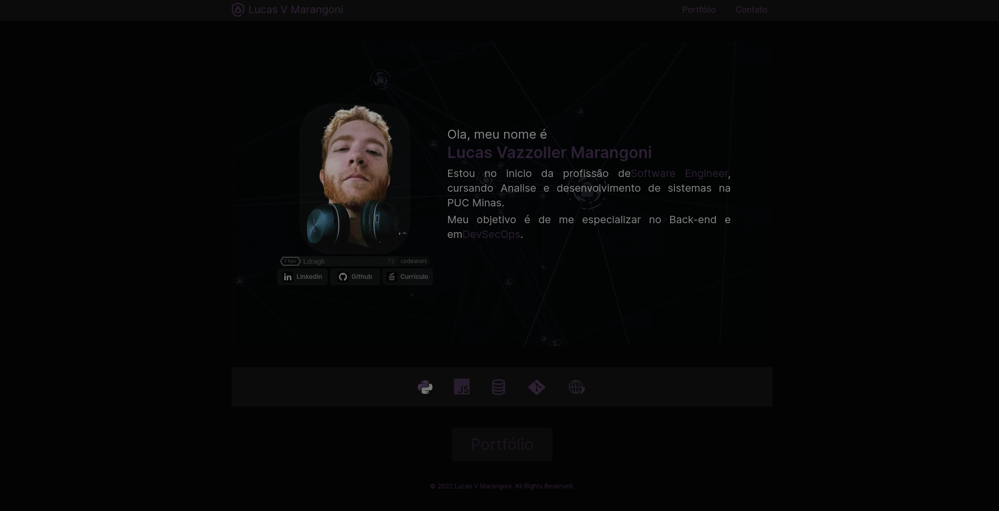

<h1 align="center">NLW Ignite eSports 2022</h1>

  <a href="#-tecnologias">Tecnologias</a>&nbsp;&nbsp;&nbsp;|&nbsp;&nbsp;
  <a href="#-projeto">Projeto</a>&nbsp;&nbsp;&nbsp;|&nbsp;&nbsp;&nbsp;    

</a>

## 🚀 Tecnologias

<h2>Global</h2> 

* [TypeScript](https://www.typescriptlang.org/)
* [Vite](https://vitejs.dev/)
* [React](https://pt-br.reactjs.org/)
* [TailWind](https://tailwindcss.com/)
* [Node e NPM](https://nodejs.org/)

  

## 🔖 Projeto
Projeto Web desenvolvido para minha apresentação pessoal e exposição de meus trabalhos pessoais como Software Engineer.

 

  
